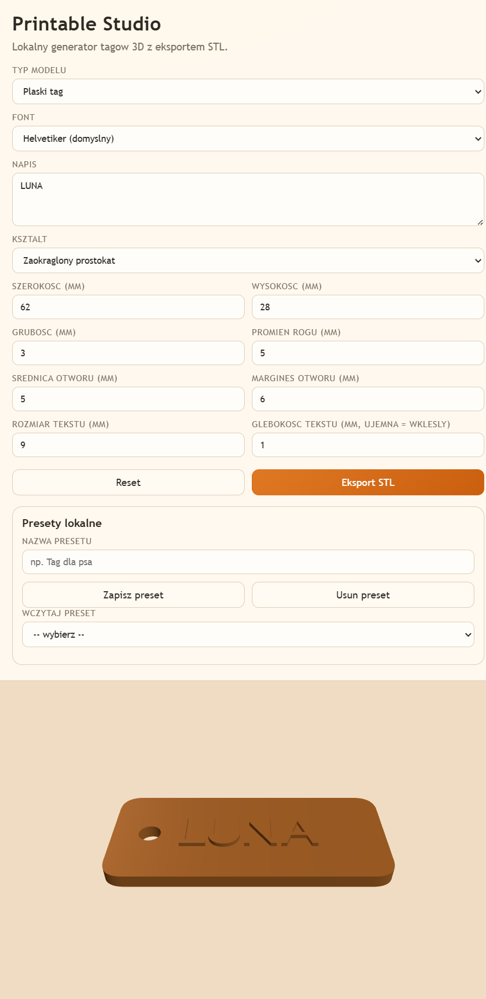

# Printable Studio

Printable Studio to webowa aplikacja do tworzenia prostych modeli 3D (tagi, zawieszki) z eksportem do STL.

## Live Demo

Demo online: https://studio.mojestrony.pl

## Screenshot



## Funkcje

- Podglad 3D modelu w czasie rzeczywistym (obrot, zoom, przesuniecie)
- Konfiguracja geometrii: ksztalt, rozmiar, grubosc, promien rogow
- Otwor na kolko z regulacja srednicy i marginesu
- Napis 3D: tekst, rozmiar i glebokosc (wypukly lub wklesly)
- Eksport modelu do pliku STL
- Lokalne presety zapisywane w localStorage
- Dzialanie po stronie klienta, bez zewnetrznego API

## Tech Stack

- TypeScript
- Vite
- Three.js
- OpenJSCAD + STL serializer

## Uruchomienie lokalne

```bash
npm install
npm run dev
```

Domyslnie aplikacja jest dostepna pod adresem: http://localhost:5173

## Build produkcyjny

```bash
npm run build
npm run preview
```

## Struktura projektu

- src/ - kod aplikacji
- public/fonts/ - lokalne fonty 3D (typeface.json)
- scripts/ - skrypty pomocnicze

## Licencja

Brak okreslonej licencji.
